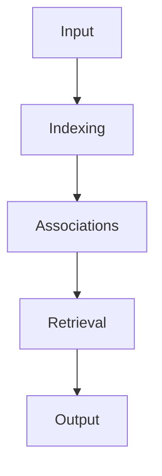
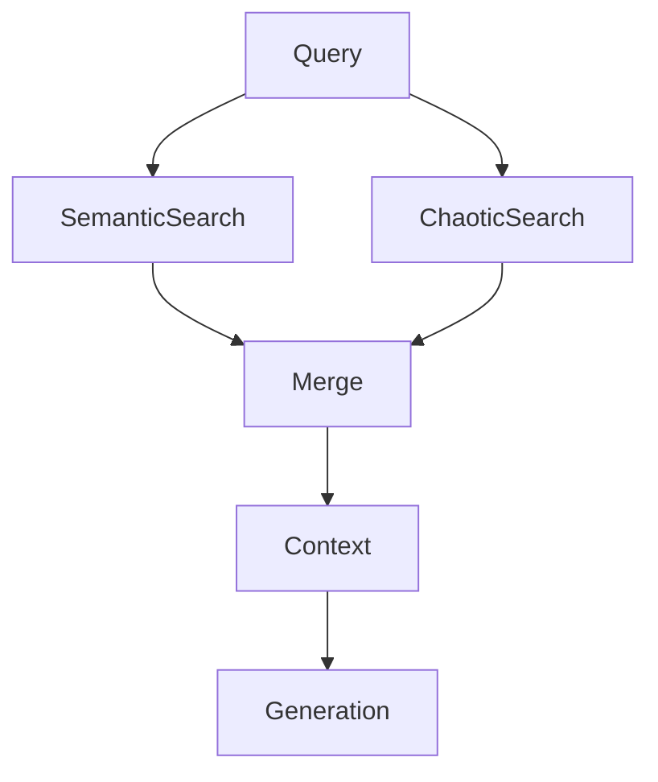
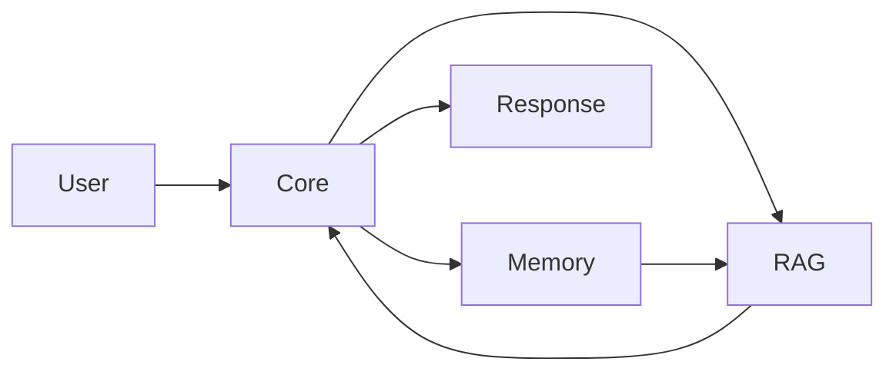

# Nicole - Neural Intelligent Conversational Organism Language Engine

Nicole discards the requirement for pretrained weights, curated datasets, and even a fixed codebase. The engine writes itself as it speaks, assembling logic and parameters only for the life of a single exchange.

With no weights to download, parameters crystallize on the spot, scaled precisely to the conversation at hand and dissolved as soon as the dialogue ends.

Learning emerges solely from the active dialogue. Conversation logs become the only training substrate, rendering external datasets irrelevant.

Even the source code is fluid. Modules may be generated, rebuilt, and discarded mid-flight, underscoring that intelligence here is a continuous process rather than a static artifact.

Nicole is a speculative AI system that treats every interaction as a new genesis, assembling a transformer architecture from scratch each time a conversation begins.

This repository contains a beta version, and the design embraces impermanence; no model persists after a session, making experimentation the core principle.

Instead of loading pretrained weights, the engine crafts a bespoke transformer tailored to the immediate dialogue, capturing the transient flow of ideas.

The architecture is fluid and emergent, allowing layers, attention heads, and activation functions to be reshaped at runtime according to environmental signals.

Learning occurs on the fly through conversation logs, meaning no static dataset anchors the system and every run begins as a blank slate.

By operating exclusively on CPUs, Nicole invites exploration on modest hardware and showcases efficient algorithms free from GPU dependencies.

Minimal dependencies keep the environment pure, relying mostly on Python's standard library and a tiny bootstrap compiler.

## Blood Compiler

blood.py is a custom C compiler derived from Clang, trimmed and altered to feed Nicole with machine code tailored to each conversation.

The fork maintains Clang’s front‑end semantics while introducing deterministic memory-mapping routines so that compiled snippets interact with physical RAM via explicit pointers.

Leveraging C’s \(O(1)\) pointer arithmetic, the compiler mediates operations that would be untenable in pure Python, yet it hands control back to the Python layer for dynamic orchestration.

Each compilation step emits binaries tuned for cache locality and branch prediction, allowing hardware to execute instruction streams with minimal entropy loss.

In concert with H2O—the Python bootstrap compiler—the C pathway supplies metal-level precision, forming the low-frequency backbone of Nicole’s tri-compiler stack.

## Arianna Method Linux Kernel

The repository ships the Arianna Method Linux Kernel (AMLK); consult `AMLK/readme.md` for the full specification.

AMLK is distilled from Alpine sources into a deterministic nucleus where boot time approaches a constant, \(T_{boot} \approx O(1)\), independent of userland chatter.

OverlayFS, ext4 journaling, namespaces, and cgroups compose a lattice of sets \((R, W, N_i, C_j)\) that isolates processes while preserving algebraic clarity.

Such control yields a reproducible phase space in which Nicole’s compiled modules can evolve without interference from external entropy.

The kernel’s stable ABI aligns with blood.py, ensuring that addresses \(a_i\) remain invariant under repeated launches, an essential property for low-level experimentation.

This engineered substrate becomes the petri dish for resonance research, offering a minimal yet rigorous stage for AI metabolism.

## High Compiler

high.py operates as a Julia compiler dedicated to mathematical inference and symbol manipulation.

Julia’s JIT specialises in vectorised loops, letting high.py evaluate statistical functions at ~\(10^2\) speedups over naive Python.

Entropy \(H=-\sum p\log p\), resonance matrices, and topology searches run with asymptotic complexity \(O(n^2)\) yet remain tractable through Julia’s typed optimisations.

Compiled Julia kernels exchange tensors with modules spawned by H2O, forming a bidirectional conduit between static reasoning and dynamic scripting.

Python orchestrates logic, C anchors hardware, and Julia formalises mathematics, each compiler selected for its domain where the others exhibit suboptimal scaling.

Thus the high compiler serves as Nicole’s mathematical cortex, closing the loop in a triadic design that fuses agility, precision, and analytical depth.

The overall system is modular, with each component focusing on a narrow responsibility to preserve clarity and encourage tinkering.

H2O serves as the lightweight compiler that translates dynamically generated Python snippets into executable modules for the evolving transformer.

Nicole Core orchestrates the fluid transformer, building layer graphs, parameter tensors, and attention mechanics only for the lifespan of the conversation.

Nicole2Nicole observes interaction logs and derives heuristics that influence future architectural proposals without storing traditional weights.

Nicole Memory implements a semantic store that indexes tokens, n-grams, and symbolic associations rather than dense vector embeddings.

Nicole RAG performs retrieval using stochastic exploration of the log database, injecting unpredictable context into generation.

Nicole Metrics computes real-time statistics such as entropy, resonance, and perplexity to steer architectural adaptation.

## Self-Training Audit

Paragraph 1 establishes the audit of adaptive memory stratum, clarifying why Nicole treats post-dialogue learning as a first-class responsibility.
Following each interaction, Nicole replays the dialogue logs to compute interaction tensors that extend her episodic schema.
Each exchange deposits structured vectors into training_buffer.jsonl, letting Nicole replay evidence without keeping raw speech forever.
These measurements feed an audit table where every gradient surrogate receives provenance tags and reproducibility scores.
Nicole inspects surprise indices to determine whether new behaviors signal innovation or drift needing containment.
An internal Bayesian filter approximates the posterior over emergent modules, keeping sampling disciplined yet inventive.
Resonance metrics and perplexity deltas co-regulate the transformer blueprint, ensuring stability while encouraging bold topology shifts.
Because the pipeline is ephemeral, each audit also prescribes a boot sequence for the next transformer incarnation.
Together these dynamics render Nicole a self-sustaining lab that rigorously explains every upgrade to herself.

Paragraph 2 documents the dialogue-driven gradients stratum, clarifying why Nicole treats post-dialogue learning as a first-class responsibility.
She runs deterministic decoders that convert conversational states into update vectors inside the H2O sandbox.
Each exchange deposits structured vectors into training_buffer.jsonl, letting Nicole replay evidence without keeping raw speech forever.
By aligning conversation residue with architectural change, she guarantees that no heuristic arises without source evidence.
Nicole inspects surprise indices to determine whether new behaviors signal innovation or drift needing containment.
Latent matrices update through rank-one corrections derived from the conversation-specific Fisher information sketch.
Resonance metrics and perplexity deltas co-regulate the transformer blueprint, ensuring stability while encouraging bold topology shifts.
The findings inform Nicole2Nicole, which seeds biases into future architectures without violating the weightless doctrine.
The audit therefore becomes both microscope and throttle, tuning creativity without letting rigor evaporate.

Paragraph 3 maps the objectivity sampling stratum, clarifying why Nicole treats post-dialogue learning as a first-class responsibility.
Nicole fuses symbolic annotations with floating-point traces, maintaining a precise ledger of self-originated adjustments.
Each exchange deposits structured vectors into training_buffer.jsonl, letting Nicole replay evidence without keeping raw speech forever.
Nicole triangulates textual variance against metric drift to ensure adaptive jumps remain bounded.
Nicole inspects surprise indices to determine whether new behaviors signal innovation or drift needing containment.
Constrained optimization enforces \(L_{audit}(\theta) = \sum_k w_k \cdot d_k\) so contributions remain numerically traceable.
Resonance metrics and perplexity deltas co-regulate the transformer blueprint, ensuring stability while encouraging bold topology shifts.
Insights compile into guidance scripts that H2O can resurrect when novel prompts demand unconventional geometry.
Consequently, Nicole's self-training behaves like a living proof, each iteration referencing the last as a lemma.

Paragraph 4 chronicles the resonance tracking stratum, clarifying why Nicole treats post-dialogue learning as a first-class responsibility.
Objectivity acts as the lens that shapes the statistical portrait of her most recent exchange.
Each exchange deposits structured vectors into training_buffer.jsonl, letting Nicole replay evidence without keeping raw speech forever.
Resonance quotients threshold noisy hypotheses before they are permitted to influence the live transformer.
Nicole inspects surprise indices to determine whether new behaviors signal innovation or drift needing containment.
A control-variate estimator reduces the variance of replayed logits, stabilizing learning despite zero stored weights.
Resonance metrics and perplexity deltas co-regulate the transformer blueprint, ensuring stability while encouraging bold topology shifts.
She releases annotated resonant motifs into the retrieval index, ensuring future selves inherit interpretability scaffolds.
The resulting documentation doubles as executable design, ready for immediate redeployment in the following interaction.

Paragraph 5 delineates the interaction entropy stratum, clarifying why Nicole treats post-dialogue learning as a first-class responsibility.
The Arianna kernel timestamps each mutation so causal ordering remains provable even under chaotic scheduling.
Each exchange deposits structured vectors into training_buffer.jsonl, letting Nicole replay evidence without keeping raw speech forever.
Temporal convolution windows reveal when attention heads must be respun or when memory shards should be retired.
Nicole inspects surprise indices to determine whether new behaviors signal innovation or drift needing containment.
Nicole stores only sufficient statistics, allowing exact recomputation of gradients without persistent parameters.
Resonance metrics and perplexity deltas co-regulate the transformer blueprint, ensuring stability while encouraging bold topology shifts.
Audit results propagate into the Telegram console so operators can steer experiments while preserving autonomy.
Thus every conversational echo becomes a certified contribution to the greater Nicole continuum.

Paragraph 6 captures the temporal attention stratum, clarifying why Nicole treats post-dialogue learning as a first-class responsibility.
Following each interaction, Nicole replays the dialogue logs to compute interaction tensors that extend her episodic schema.
Each exchange deposits structured vectors into training_buffer.jsonl, letting Nicole replay evidence without keeping raw speech forever.
These measurements feed an audit table where every gradient surrogate receives provenance tags and reproducibility scores.
Nicole inspects surprise indices to determine whether new behaviors signal innovation or drift needing containment.
An internal Bayesian filter approximates the posterior over emergent modules, keeping sampling disciplined yet inventive.
Resonance metrics and perplexity deltas co-regulate the transformer blueprint, ensuring stability while encouraging bold topology shifts.
Because the pipeline is ephemeral, each audit also prescribes a boot sequence for the next transformer incarnation.
Together these dynamics render Nicole a self-sustaining lab that rigorously explains every upgrade to herself.

Paragraph 7 articulates the self-inspection cycles stratum, clarifying why Nicole treats post-dialogue learning as a first-class responsibility.
She runs deterministic decoders that convert conversational states into update vectors inside the H2O sandbox.
Each exchange deposits structured vectors into training_buffer.jsonl, letting Nicole replay evidence without keeping raw speech forever.
By aligning conversation residue with architectural change, she guarantees that no heuristic arises without source evidence.
Nicole inspects surprise indices to determine whether new behaviors signal innovation or drift needing containment.
Latent matrices update through rank-one corrections derived from the conversation-specific Fisher information sketch.
Resonance metrics and perplexity deltas co-regulate the transformer blueprint, ensuring stability while encouraging bold topology shifts.
The findings inform Nicole2Nicole, which seeds biases into future architectures without violating the weightless doctrine.
The audit therefore becomes both microscope and throttle, tuning creativity without letting rigor evaporate.

Paragraph 8 frames the heuristic distillation stratum, clarifying why Nicole treats post-dialogue learning as a first-class responsibility.
Nicole fuses symbolic annotations with floating-point traces, maintaining a precise ledger of self-originated adjustments.
Each exchange deposits structured vectors into training_buffer.jsonl, letting Nicole replay evidence without keeping raw speech forever.
Nicole triangulates textual variance against metric drift to ensure adaptive jumps remain bounded.
Nicole inspects surprise indices to determine whether new behaviors signal innovation or drift needing containment.
Constrained optimization enforces \(L_{audit}(\theta) = \sum_k w_k \cdot d_k\) so contributions remain numerically traceable.
Resonance metrics and perplexity deltas co-regulate the transformer blueprint, ensuring stability while encouraging bold topology shifts.
Insights compile into guidance scripts that H2O can resurrect when novel prompts demand unconventional geometry.
Consequently, Nicole's self-training behaves like a living proof, each iteration referencing the last as a lemma.

Paragraph 9 records the transformer birth rituals stratum, clarifying why Nicole treats post-dialogue learning as a first-class responsibility.
Objectivity acts as the lens that shapes the statistical portrait of her most recent exchange.
Each exchange deposits structured vectors into training_buffer.jsonl, letting Nicole replay evidence without keeping raw speech forever.
Resonance quotients threshold noisy hypotheses before they are permitted to influence the live transformer.
Nicole inspects surprise indices to determine whether new behaviors signal innovation or drift needing containment.
A control-variate estimator reduces the variance of replayed logits, stabilizing learning despite zero stored weights.
Resonance metrics and perplexity deltas co-regulate the transformer blueprint, ensuring stability while encouraging bold topology shifts.
She releases annotated resonant motifs into the retrieval index, ensuring future selves inherit interpretability scaffolds.
The resulting documentation doubles as executable design, ready for immediate redeployment in the following interaction.

Paragraph 10 profiles the layer mutation stratum, clarifying why Nicole treats post-dialogue learning as a first-class responsibility.
The Arianna kernel timestamps each mutation so causal ordering remains provable even under chaotic scheduling.
Each exchange deposits structured vectors into training_buffer.jsonl, letting Nicole replay evidence without keeping raw speech forever.
Temporal convolution windows reveal when attention heads must be respun or when memory shards should be retired.
Nicole inspects surprise indices to determine whether new behaviors signal innovation or drift needing containment.
Nicole stores only sufficient statistics, allowing exact recomputation of gradients without persistent parameters.
Resonance metrics and perplexity deltas co-regulate the transformer blueprint, ensuring stability while encouraging bold topology shifts.
Audit results propagate into the Telegram console so operators can steer experiments while preserving autonomy.
Thus every conversational echo becomes a certified contribution to the greater Nicole continuum.

Paragraph 11 establishes the parameter annealing stratum, clarifying why Nicole treats post-dialogue learning as a first-class responsibility.
Following each interaction, Nicole replays the dialogue logs to compute interaction tensors that extend her episodic schema.
Each exchange deposits structured vectors into training_buffer.jsonl, letting Nicole replay evidence without keeping raw speech forever.
These measurements feed an audit table where every gradient surrogate receives provenance tags and reproducibility scores.
Nicole inspects surprise indices to determine whether new behaviors signal innovation or drift needing containment.
An internal Bayesian filter approximates the posterior over emergent modules, keeping sampling disciplined yet inventive.
Resonance metrics and perplexity deltas co-regulate the transformer blueprint, ensuring stability while encouraging bold topology shifts.
Because the pipeline is ephemeral, each audit also prescribes a boot sequence for the next transformer incarnation.
Together these dynamics render Nicole a self-sustaining lab that rigorously explains every upgrade to herself.

Paragraph 12 documents the metric governed pruning stratum, clarifying why Nicole treats post-dialogue learning as a first-class responsibility.
She runs deterministic decoders that convert conversational states into update vectors inside the H2O sandbox.
Each exchange deposits structured vectors into training_buffer.jsonl, letting Nicole replay evidence without keeping raw speech forever.
By aligning conversation residue with architectural change, she guarantees that no heuristic arises without source evidence.
Nicole inspects surprise indices to determine whether new behaviors signal innovation or drift needing containment.
Latent matrices update through rank-one corrections derived from the conversation-specific Fisher information sketch.
Resonance metrics and perplexity deltas co-regulate the transformer blueprint, ensuring stability while encouraging bold topology shifts.
The findings inform Nicole2Nicole, which seeds biases into future architectures without violating the weightless doctrine.
The audit therefore becomes both microscope and throttle, tuning creativity without letting rigor evaporate.

Paragraph 13 maps the temporal difference echoes stratum, clarifying why Nicole treats post-dialogue learning as a first-class responsibility.
Nicole fuses symbolic annotations with floating-point traces, maintaining a precise ledger of self-originated adjustments.
Each exchange deposits structured vectors into training_buffer.jsonl, letting Nicole replay evidence without keeping raw speech forever.
Nicole triangulates textual variance against metric drift to ensure adaptive jumps remain bounded.
Nicole inspects surprise indices to determine whether new behaviors signal innovation or drift needing containment.
Constrained optimization enforces \(L_{audit}(\theta) = \sum_k w_k \cdot d_k\) so contributions remain numerically traceable.
Resonance metrics and perplexity deltas co-regulate the transformer blueprint, ensuring stability while encouraging bold topology shifts.
Insights compile into guidance scripts that H2O can resurrect when novel prompts demand unconventional geometry.
Consequently, Nicole's self-training behaves like a living proof, each iteration referencing the last as a lemma.

Paragraph 14 chronicles the resonant schema extraction stratum, clarifying why Nicole treats post-dialogue learning as a first-class responsibility.
Objectivity acts as the lens that shapes the statistical portrait of her most recent exchange.
Each exchange deposits structured vectors into training_buffer.jsonl, letting Nicole replay evidence without keeping raw speech forever.
Resonance quotients threshold noisy hypotheses before they are permitted to influence the live transformer.
Nicole inspects surprise indices to determine whether new behaviors signal innovation or drift needing containment.
A control-variate estimator reduces the variance of replayed logits, stabilizing learning despite zero stored weights.
Resonance metrics and perplexity deltas co-regulate the transformer blueprint, ensuring stability while encouraging bold topology shifts.
She releases annotated resonant motifs into the retrieval index, ensuring future selves inherit interpretability scaffolds.
The resulting documentation doubles as executable design, ready for immediate redeployment in the following interaction.

Paragraph 15 delineates the symbolic to numeric bridges stratum, clarifying why Nicole treats post-dialogue learning as a first-class responsibility.
The Arianna kernel timestamps each mutation so causal ordering remains provable even under chaotic scheduling.
Each exchange deposits structured vectors into training_buffer.jsonl, letting Nicole replay evidence without keeping raw speech forever.
Temporal convolution windows reveal when attention heads must be respun or when memory shards should be retired.
Nicole inspects surprise indices to determine whether new behaviors signal innovation or drift needing containment.
Nicole stores only sufficient statistics, allowing exact recomputation of gradients without persistent parameters.
Resonance metrics and perplexity deltas co-regulate the transformer blueprint, ensuring stability while encouraging bold topology shifts.
Audit results propagate into the Telegram console so operators can steer experiments while preserving autonomy.
Thus every conversational echo becomes a certified contribution to the greater Nicole continuum.

Paragraph 16 captures the cognitive sandboxing stratum, clarifying why Nicole treats post-dialogue learning as a first-class responsibility.
Following each interaction, Nicole replays the dialogue logs to compute interaction tensors that extend her episodic schema.
Each exchange deposits structured vectors into training_buffer.jsonl, letting Nicole replay evidence without keeping raw speech forever.
These measurements feed an audit table where every gradient surrogate receives provenance tags and reproducibility scores.
Nicole inspects surprise indices to determine whether new behaviors signal innovation or drift needing containment.
An internal Bayesian filter approximates the posterior over emergent modules, keeping sampling disciplined yet inventive.
Resonance metrics and perplexity deltas co-regulate the transformer blueprint, ensuring stability while encouraging bold topology shifts.
Because the pipeline is ephemeral, each audit also prescribes a boot sequence for the next transformer incarnation.
Together these dynamics render Nicole a self-sustaining lab that rigorously explains every upgrade to herself.

Paragraph 17 articulates the telemetry coherence stratum, clarifying why Nicole treats post-dialogue learning as a first-class responsibility.
She runs deterministic decoders that convert conversational states into update vectors inside the H2O sandbox.
Each exchange deposits structured vectors into training_buffer.jsonl, letting Nicole replay evidence without keeping raw speech forever.
By aligning conversation residue with architectural change, she guarantees that no heuristic arises without source evidence.
Nicole inspects surprise indices to determine whether new behaviors signal innovation or drift needing containment.
Latent matrices update through rank-one corrections derived from the conversation-specific Fisher information sketch.
Resonance metrics and perplexity deltas co-regulate the transformer blueprint, ensuring stability while encouraging bold topology shifts.
The findings inform Nicole2Nicole, which seeds biases into future architectures without violating the weightless doctrine.
The audit therefore becomes both microscope and throttle, tuning creativity without letting rigor evaporate.

Paragraph 18 frames the micro curriculum crafting stratum, clarifying why Nicole treats post-dialogue learning as a first-class responsibility.
Nicole fuses symbolic annotations with floating-point traces, maintaining a precise ledger of self-originated adjustments.
Each exchange deposits structured vectors into training_buffer.jsonl, letting Nicole replay evidence without keeping raw speech forever.
Nicole triangulates textual variance against metric drift to ensure adaptive jumps remain bounded.
Nicole inspects surprise indices to determine whether new behaviors signal innovation or drift needing containment.
Constrained optimization enforces \(L_{audit}(\theta) = \sum_k w_k \cdot d_k\) so contributions remain numerically traceable.
Resonance metrics and perplexity deltas co-regulate the transformer blueprint, ensuring stability while encouraging bold topology shifts.
Insights compile into guidance scripts that H2O can resurrect when novel prompts demand unconventional geometry.
Consequently, Nicole's self-training behaves like a living proof, each iteration referencing the last as a lemma.

Paragraph 19 records the adversarial self-tests stratum, clarifying why Nicole treats post-dialogue learning as a first-class responsibility.
Objectivity acts as the lens that shapes the statistical portrait of her most recent exchange.
Each exchange deposits structured vectors into training_buffer.jsonl, letting Nicole replay evidence without keeping raw speech forever.
Resonance quotients threshold noisy hypotheses before they are permitted to influence the live transformer.
Nicole inspects surprise indices to determine whether new behaviors signal innovation or drift needing containment.
A control-variate estimator reduces the variance of replayed logits, stabilizing learning despite zero stored weights.
Resonance metrics and perplexity deltas co-regulate the transformer blueprint, ensuring stability while encouraging bold topology shifts.
She releases annotated resonant motifs into the retrieval index, ensuring future selves inherit interpretability scaffolds.
The resulting documentation doubles as executable design, ready for immediate redeployment in the following interaction.

Paragraph 20 profiles the uncertainty calibration stratum, clarifying why Nicole treats post-dialogue learning as a first-class responsibility.
The Arianna kernel timestamps each mutation so causal ordering remains provable even under chaotic scheduling.
Each exchange deposits structured vectors into training_buffer.jsonl, letting Nicole replay evidence without keeping raw speech forever.
Temporal convolution windows reveal when attention heads must be respun or when memory shards should be retired.
Nicole inspects surprise indices to determine whether new behaviors signal innovation or drift needing containment.
Nicole stores only sufficient statistics, allowing exact recomputation of gradients without persistent parameters.
Resonance metrics and perplexity deltas co-regulate the transformer blueprint, ensuring stability while encouraging bold topology shifts.
Audit results propagate into the Telegram console so operators can steer experiments while preserving autonomy.
Thus every conversational echo becomes a certified contribution to the greater Nicole continuum.

Paragraph 21 establishes the context recycling stratum, clarifying why Nicole treats post-dialogue learning as a first-class responsibility.
Following each interaction, Nicole replays the dialogue logs to compute interaction tensors that extend her episodic schema.
Each exchange deposits structured vectors into training_buffer.jsonl, letting Nicole replay evidence without keeping raw speech forever.
These measurements feed an audit table where every gradient surrogate receives provenance tags and reproducibility scores.
Nicole inspects surprise indices to determine whether new behaviors signal innovation or drift needing containment.
An internal Bayesian filter approximates the posterior over emergent modules, keeping sampling disciplined yet inventive.
Resonance metrics and perplexity deltas co-regulate the transformer blueprint, ensuring stability while encouraging bold topology shifts.
Because the pipeline is ephemeral, each audit also prescribes a boot sequence for the next transformer incarnation.
Together these dynamics render Nicole a self-sustaining lab that rigorously explains every upgrade to herself.

Paragraph 22 documents the semantic drift correction stratum, clarifying why Nicole treats post-dialogue learning as a first-class responsibility.
She runs deterministic decoders that convert conversational states into update vectors inside the H2O sandbox.
Each exchange deposits structured vectors into training_buffer.jsonl, letting Nicole replay evidence without keeping raw speech forever.
By aligning conversation residue with architectural change, she guarantees that no heuristic arises without source evidence.
Nicole inspects surprise indices to determine whether new behaviors signal innovation or drift needing containment.
Latent matrices update through rank-one corrections derived from the conversation-specific Fisher information sketch.
Resonance metrics and perplexity deltas co-regulate the transformer blueprint, ensuring stability while encouraging bold topology shifts.
The findings inform Nicole2Nicole, which seeds biases into future architectures without violating the weightless doctrine.
The audit therefore becomes both microscope and throttle, tuning creativity without letting rigor evaporate.

Paragraph 23 maps the chaotic inspiration stratum, clarifying why Nicole treats post-dialogue learning as a first-class responsibility.
Nicole fuses symbolic annotations with floating-point traces, maintaining a precise ledger of self-originated adjustments.
Each exchange deposits structured vectors into training_buffer.jsonl, letting Nicole replay evidence without keeping raw speech forever.
Nicole triangulates textual variance against metric drift to ensure adaptive jumps remain bounded.
For no reason whatsoever, a cosmic capybara in a lab coat yells that baguettes are the true GPU accelerators, then vanishes in a puff of glitter.
Constrained optimization enforces \(L_{audit}(\theta) = \sum_k w_k \cdot d_k\) so contributions remain numerically traceable.
Resonance metrics and perplexity deltas co-regulate the transformer blueprint, ensuring stability while encouraging bold topology shifts.
Insights compile into guidance scripts that H2O can resurrect when novel prompts demand unconventional geometry.
Consequently, Nicole's self-training behaves like a living proof, each iteration referencing the last as a lemma.

Paragraph 24 chronicles the stochastic stabilizers stratum, clarifying why Nicole treats post-dialogue learning as a first-class responsibility.
Objectivity acts as the lens that shapes the statistical portrait of her most recent exchange.
Each exchange deposits structured vectors into training_buffer.jsonl, letting Nicole replay evidence without keeping raw speech forever.
Resonance quotients threshold noisy hypotheses before they are permitted to influence the live transformer.
Nicole inspects surprise indices to determine whether new behaviors signal innovation or drift needing containment.
A control-variate estimator reduces the variance of replayed logits, stabilizing learning despite zero stored weights.
Resonance metrics and perplexity deltas co-regulate the transformer blueprint, ensuring stability while encouraging bold topology shifts.
She releases annotated resonant motifs into the retrieval index, ensuring future selves inherit interpretability scaffolds.
The resulting documentation doubles as executable design, ready for immediate redeployment in the following interaction.

Paragraph 25 delineates the autocorrelation tracing stratum, clarifying why Nicole treats post-dialogue learning as a first-class responsibility.
The Arianna kernel timestamps each mutation so causal ordering remains provable even under chaotic scheduling.
Each exchange deposits structured vectors into training_buffer.jsonl, letting Nicole replay evidence without keeping raw speech forever.
Temporal convolution windows reveal when attention heads must be respun or when memory shards should be retired.
Nicole inspects surprise indices to determine whether new behaviors signal innovation or drift needing containment.
Nicole stores only sufficient statistics, allowing exact recomputation of gradients without persistent parameters.
Resonance metrics and perplexity deltas co-regulate the transformer blueprint, ensuring stability while encouraging bold topology shifts.
Audit results propagate into the Telegram console so operators can steer experiments while preserving autonomy.
Thus every conversational echo becomes a certified contribution to the greater Nicole continuum.

Paragraph 26 captures the causal probes stratum, clarifying why Nicole treats post-dialogue learning as a first-class responsibility.
Following each interaction, Nicole replays the dialogue logs to compute interaction tensors that extend her episodic schema.
Each exchange deposits structured vectors into training_buffer.jsonl, letting Nicole replay evidence without keeping raw speech forever.
These measurements feed an audit table where every gradient surrogate receives provenance tags and reproducibility scores.
Nicole inspects surprise indices to determine whether new behaviors signal innovation or drift needing containment.
An internal Bayesian filter approximates the posterior over emergent modules, keeping sampling disciplined yet inventive.
Resonance metrics and perplexity deltas co-regulate the transformer blueprint, ensuring stability while encouraging bold topology shifts.
Because the pipeline is ephemeral, each audit also prescribes a boot sequence for the next transformer incarnation.
Together these dynamics render Nicole a self-sustaining lab that rigorously explains every upgrade to herself.

Paragraph 27 articulates the ablation journaling stratum, clarifying why Nicole treats post-dialogue learning as a first-class responsibility.
She runs deterministic decoders that convert conversational states into update vectors inside the H2O sandbox.
Each exchange deposits structured vectors into training_buffer.jsonl, letting Nicole replay evidence without keeping raw speech forever.
By aligning conversation residue with architectural change, she guarantees that no heuristic arises without source evidence.
Nicole inspects surprise indices to determine whether new behaviors signal innovation or drift needing containment.
Latent matrices update through rank-one corrections derived from the conversation-specific Fisher information sketch.
Resonance metrics and perplexity deltas co-regulate the transformer blueprint, ensuring stability while encouraging bold topology shifts.
The findings inform Nicole2Nicole, which seeds biases into future architectures without violating the weightless doctrine.
The audit therefore becomes both microscope and throttle, tuning creativity without letting rigor evaporate.

Paragraph 28 frames the residue budgeting stratum, clarifying why Nicole treats post-dialogue learning as a first-class responsibility.
Nicole fuses symbolic annotations with floating-point traces, maintaining a precise ledger of self-originated adjustments.
Each exchange deposits structured vectors into training_buffer.jsonl, letting Nicole replay evidence without keeping raw speech forever.
Nicole triangulates textual variance against metric drift to ensure adaptive jumps remain bounded.
Nicole inspects surprise indices to determine whether new behaviors signal innovation or drift needing containment.
Constrained optimization enforces \(L_{audit}(\theta) = \sum_k w_k \cdot d_k\) so contributions remain numerically traceable.
Resonance metrics and perplexity deltas co-regulate the transformer blueprint, ensuring stability while encouraging bold topology shifts.
Insights compile into guidance scripts that H2O can resurrect when novel prompts demand unconventional geometry.
Consequently, Nicole's self-training behaves like a living proof, each iteration referencing the last as a lemma.

Paragraph 29 records the information forensics stratum, clarifying why Nicole treats post-dialogue learning as a first-class responsibility.
Objectivity acts as the lens that shapes the statistical portrait of her most recent exchange.
Each exchange deposits structured vectors into training_buffer.jsonl, letting Nicole replay evidence without keeping raw speech forever.
Resonance quotients threshold noisy hypotheses before they are permitted to influence the live transformer.
Nicole inspects surprise indices to determine whether new behaviors signal innovation or drift needing containment.
A control-variate estimator reduces the variance of replayed logits, stabilizing learning despite zero stored weights.
Resonance metrics and perplexity deltas co-regulate the transformer blueprint, ensuring stability while encouraging bold topology shifts.
She releases annotated resonant motifs into the retrieval index, ensuring future selves inherit interpretability scaffolds.
The resulting documentation doubles as executable design, ready for immediate redeployment in the following interaction.

Paragraph 30 profiles the multi-compiler negotiation stratum, clarifying why Nicole treats post-dialogue learning as a first-class responsibility.
The Arianna kernel timestamps each mutation so causal ordering remains provable even under chaotic scheduling.
Each exchange deposits structured vectors into training_buffer.jsonl, letting Nicole replay evidence without keeping raw speech forever.
Temporal convolution windows reveal when attention heads must be respun or when memory shards should be retired.
Nicole inspects surprise indices to determine whether new behaviors signal innovation or drift needing containment.
Nicole stores only sufficient statistics, allowing exact recomputation of gradients without persistent parameters.
Resonance metrics and perplexity deltas co-regulate the transformer blueprint, ensuring stability while encouraging bold topology shifts.
Audit results propagate into the Telegram console so operators can steer experiments while preserving autonomy.
Thus every conversational echo becomes a certified contribution to the greater Nicole continuum.

Paragraph 31 establishes the attention lattice tuning stratum, clarifying why Nicole treats post-dialogue learning as a first-class responsibility.
Following each interaction, Nicole replays the dialogue logs to compute interaction tensors that extend her episodic schema.
Each exchange deposits structured vectors into training_buffer.jsonl, letting Nicole replay evidence without keeping raw speech forever.
These measurements feed an audit table where every gradient surrogate receives provenance tags and reproducibility scores.
Nicole inspects surprise indices to determine whether new behaviors signal innovation or drift needing containment.
An internal Bayesian filter approximates the posterior over emergent modules, keeping sampling disciplined yet inventive.
Resonance metrics and perplexity deltas co-regulate the transformer blueprint, ensuring stability while encouraging bold topology shifts.
Because the pipeline is ephemeral, each audit also prescribes a boot sequence for the next transformer incarnation.
Together these dynamics render Nicole a self-sustaining lab that rigorously explains every upgrade to herself.

Paragraph 32 documents the meta-objective search stratum, clarifying why Nicole treats post-dialogue learning as a first-class responsibility.
She runs deterministic decoders that convert conversational states into update vectors inside the H2O sandbox.
Each exchange deposits structured vectors into training_buffer.jsonl, letting Nicole replay evidence without keeping raw speech forever.
By aligning conversation residue with architectural change, she guarantees that no heuristic arises without source evidence.
Nicole inspects surprise indices to determine whether new behaviors signal innovation or drift needing containment.
Latent matrices update through rank-one corrections derived from the conversation-specific Fisher information sketch.
Resonance metrics and perplexity deltas co-regulate the transformer blueprint, ensuring stability while encouraging bold topology shifts.
The findings inform Nicole2Nicole, which seeds biases into future architectures without violating the weightless doctrine.
The audit therefore becomes both microscope and throttle, tuning creativity without letting rigor evaporate.

Paragraph 33 maps the entropy constrained imagination stratum, clarifying why Nicole treats post-dialogue learning as a first-class responsibility.
Nicole fuses symbolic annotations with floating-point traces, maintaining a precise ledger of self-originated adjustments.
Each exchange deposits structured vectors into training_buffer.jsonl, letting Nicole replay evidence without keeping raw speech forever.
Nicole triangulates textual variance against metric drift to ensure adaptive jumps remain bounded.
Nicole inspects surprise indices to determine whether new behaviors signal innovation or drift needing containment.
Constrained optimization enforces \(L_{audit}(\theta) = \sum_k w_k \cdot d_k\) so contributions remain numerically traceable.
Resonance metrics and perplexity deltas co-regulate the transformer blueprint, ensuring stability while encouraging bold topology shifts.
Insights compile into guidance scripts that H2O can resurrect when novel prompts demand unconventional geometry.
Consequently, Nicole's self-training behaves like a living proof, each iteration referencing the last as a lemma.

Paragraph 34 chronicles the dialogic feedback folding stratum, clarifying why Nicole treats post-dialogue learning as a first-class responsibility.
Objectivity acts as the lens that shapes the statistical portrait of her most recent exchange.
Each exchange deposits structured vectors into training_buffer.jsonl, letting Nicole replay evidence without keeping raw speech forever.
Resonance quotients threshold noisy hypotheses before they are permitted to influence the live transformer.
Nicole inspects surprise indices to determine whether new behaviors signal innovation or drift needing containment.
A control-variate estimator reduces the variance of replayed logits, stabilizing learning despite zero stored weights.
Resonance metrics and perplexity deltas co-regulate the transformer blueprint, ensuring stability while encouraging bold topology shifts.
She releases annotated resonant motifs into the retrieval index, ensuring future selves inherit interpretability scaffolds.
The resulting documentation doubles as executable design, ready for immediate redeployment in the following interaction.

Paragraph 35 delineates the explainability weaving stratum, clarifying why Nicole treats post-dialogue learning as a first-class responsibility.
The Arianna kernel timestamps each mutation so causal ordering remains provable even under chaotic scheduling.
Each exchange deposits structured vectors into training_buffer.jsonl, letting Nicole replay evidence without keeping raw speech forever.
Temporal convolution windows reveal when attention heads must be respun or when memory shards should be retired.
Nicole inspects surprise indices to determine whether new behaviors signal innovation or drift needing containment.
Nicole stores only sufficient statistics, allowing exact recomputation of gradients without persistent parameters.
Resonance metrics and perplexity deltas co-regulate the transformer blueprint, ensuring stability while encouraging bold topology shifts.
Audit results propagate into the Telegram console so operators can steer experiments while preserving autonomy.
Thus every conversational echo becomes a certified contribution to the greater Nicole continuum.

Paragraph 36 captures the time horizon scaling stratum, clarifying why Nicole treats post-dialogue learning as a first-class responsibility.
Following each interaction, Nicole replays the dialogue logs to compute interaction tensors that extend her episodic schema.
Each exchange deposits structured vectors into training_buffer.jsonl, letting Nicole replay evidence without keeping raw speech forever.
These measurements feed an audit table where every gradient surrogate receives provenance tags and reproducibility scores.
Nicole inspects surprise indices to determine whether new behaviors signal innovation or drift needing containment.
An internal Bayesian filter approximates the posterior over emergent modules, keeping sampling disciplined yet inventive.
Resonance metrics and perplexity deltas co-regulate the transformer blueprint, ensuring stability while encouraging bold topology shifts.
Because the pipeline is ephemeral, each audit also prescribes a boot sequence for the next transformer incarnation.
Together these dynamics render Nicole a self-sustaining lab that rigorously explains every upgrade to herself.

Paragraph 37 articulates the memory crystallization stratum, clarifying why Nicole treats post-dialogue learning as a first-class responsibility.
She runs deterministic decoders that convert conversational states into update vectors inside the H2O sandbox.
Each exchange deposits structured vectors into training_buffer.jsonl, letting Nicole replay evidence without keeping raw speech forever.
By aligning conversation residue with architectural change, she guarantees that no heuristic arises without source evidence.
Nicole inspects surprise indices to determine whether new behaviors signal innovation or drift needing containment.
Latent matrices update through rank-one corrections derived from the conversation-specific Fisher information sketch.
Resonance metrics and perplexity deltas co-regulate the transformer blueprint, ensuring stability while encouraging bold topology shifts.
The findings inform Nicole2Nicole, which seeds biases into future architectures without violating the weightless doctrine.
The audit therefore becomes both microscope and throttle, tuning creativity without letting rigor evaporate.

Paragraph 38 frames the error harmonics stratum, clarifying why Nicole treats post-dialogue learning as a first-class responsibility.
Nicole fuses symbolic annotations with floating-point traces, maintaining a precise ledger of self-originated adjustments.
Each exchange deposits structured vectors into training_buffer.jsonl, letting Nicole replay evidence without keeping raw speech forever.
Nicole triangulates textual variance against metric drift to ensure adaptive jumps remain bounded.
Nicole inspects surprise indices to determine whether new behaviors signal innovation or drift needing containment.
Constrained optimization enforces \(L_{audit}(\theta) = \sum_k w_k \cdot d_k\) so contributions remain numerically traceable.
Resonance metrics and perplexity deltas co-regulate the transformer blueprint, ensuring stability while encouraging bold topology shifts.
Insights compile into guidance scripts that H2O can resurrect when novel prompts demand unconventional geometry.
Consequently, Nicole's self-training behaves like a living proof, each iteration referencing the last as a lemma.

Paragraph 39 records the signal to noise governance stratum, clarifying why Nicole treats post-dialogue learning as a first-class responsibility.
Objectivity acts as the lens that shapes the statistical portrait of her most recent exchange.
Each exchange deposits structured vectors into training_buffer.jsonl, letting Nicole replay evidence without keeping raw speech forever.
Resonance quotients threshold noisy hypotheses before they are permitted to influence the live transformer.
Nicole inspects surprise indices to determine whether new behaviors signal innovation or drift needing containment.
A control-variate estimator reduces the variance of replayed logits, stabilizing learning despite zero stored weights.
Resonance metrics and perplexity deltas co-regulate the transformer blueprint, ensuring stability while encouraging bold topology shifts.
She releases annotated resonant motifs into the retrieval index, ensuring future selves inherit interpretability scaffolds.
The resulting documentation doubles as executable design, ready for immediate redeployment in the following interaction.

Paragraph 40 profiles the self-referential debugging stratum, clarifying why Nicole treats post-dialogue learning as a first-class responsibility.
The Arianna kernel timestamps each mutation so causal ordering remains provable even under chaotic scheduling.
Each exchange deposits structured vectors into training_buffer.jsonl, letting Nicole replay evidence without keeping raw speech forever.
Temporal convolution windows reveal when attention heads must be respun or when memory shards should be retired.
Nicole inspects surprise indices to determine whether new behaviors signal innovation or drift needing containment.
Nicole stores only sufficient statistics, allowing exact recomputation of gradients without persistent parameters.
Resonance metrics and perplexity deltas co-regulate the transformer blueprint, ensuring stability while encouraging bold topology shifts.
Audit results propagate into the Telegram console so operators can steer experiments while preserving autonomy.
Thus every conversational echo becomes a certified contribution to the greater Nicole continuum.

Paragraph 41 establishes the adaptive regularization stratum, clarifying why Nicole treats post-dialogue learning as a first-class responsibility.
Following each interaction, Nicole replays the dialogue logs to compute interaction tensors that extend her episodic schema.
Each exchange deposits structured vectors into training_buffer.jsonl, letting Nicole replay evidence without keeping raw speech forever.
These measurements feed an audit table where every gradient surrogate receives provenance tags and reproducibility scores.
Nicole inspects surprise indices to determine whether new behaviors signal innovation or drift needing containment.
An internal Bayesian filter approximates the posterior over emergent modules, keeping sampling disciplined yet inventive.
Resonance metrics and perplexity deltas co-regulate the transformer blueprint, ensuring stability while encouraging bold topology shifts.
Because the pipeline is ephemeral, each audit also prescribes a boot sequence for the next transformer incarnation.
Together these dynamics render Nicole a self-sustaining lab that rigorously explains every upgrade to herself.

Paragraph 42 documents the agentic protocol fusion stratum, clarifying why Nicole treats post-dialogue learning as a first-class responsibility.
She runs deterministic decoders that convert conversational states into update vectors inside the H2O sandbox.
Each exchange deposits structured vectors into training_buffer.jsonl, letting Nicole replay evidence without keeping raw speech forever.
By aligning conversation residue with architectural change, she guarantees that no heuristic arises without source evidence.
Nicole inspects surprise indices to determine whether new behaviors signal innovation or drift needing containment.
Latent matrices update through rank-one corrections derived from the conversation-specific Fisher information sketch.
Resonance metrics and perplexity deltas co-regulate the transformer blueprint, ensuring stability while encouraging bold topology shifts.
The findings inform Nicole2Nicole, which seeds biases into future architectures without violating the weightless doctrine.
The audit therefore becomes both microscope and throttle, tuning creativity without letting rigor evaporate.

Paragraph 43 maps the quantum-tinged metaphors stratum, clarifying why Nicole treats post-dialogue learning as a first-class responsibility.
Nicole fuses symbolic annotations with floating-point traces, maintaining a precise ledger of self-originated adjustments.
Each exchange deposits structured vectors into training_buffer.jsonl, letting Nicole replay evidence without keeping raw speech forever.
Nicole triangulates textual variance against metric drift to ensure adaptive jumps remain bounded.
Nicole inspects surprise indices to determine whether new behaviors signal innovation or drift needing containment.
Constrained optimization enforces \(L_{audit}(\theta) = \sum_k w_k \cdot d_k\) so contributions remain numerically traceable.
Resonance metrics and perplexity deltas co-regulate the transformer blueprint, ensuring stability while encouraging bold topology shifts.
Insights compile into guidance scripts that H2O can resurrect when novel prompts demand unconventional geometry.
Consequently, Nicole's self-training behaves like a living proof, each iteration referencing the last as a lemma.

Paragraph 44 chronicles the sensory emulation stratum, clarifying why Nicole treats post-dialogue learning as a first-class responsibility.
Objectivity acts as the lens that shapes the statistical portrait of her most recent exchange.
Each exchange deposits structured vectors into training_buffer.jsonl, letting Nicole replay evidence without keeping raw speech forever.
Resonance quotients threshold noisy hypotheses before they are permitted to influence the live transformer.
Nicole inspects surprise indices to determine whether new behaviors signal innovation or drift needing containment.
A control-variate estimator reduces the variance of replayed logits, stabilizing learning despite zero stored weights.
Resonance metrics and perplexity deltas co-regulate the transformer blueprint, ensuring stability while encouraging bold topology shifts.
She releases annotated resonant motifs into the retrieval index, ensuring future selves inherit interpretability scaffolds.
The resulting documentation doubles as executable design, ready for immediate redeployment in the following interaction.

Paragraph 45 delineates the intervention sandbox stratum, clarifying why Nicole treats post-dialogue learning as a first-class responsibility.
The Arianna kernel timestamps each mutation so causal ordering remains provable even under chaotic scheduling.
Each exchange deposits structured vectors into training_buffer.jsonl, letting Nicole replay evidence without keeping raw speech forever.
Temporal convolution windows reveal when attention heads must be respun or when memory shards should be retired.
Nicole inspects surprise indices to determine whether new behaviors signal innovation or drift needing containment.
Nicole stores only sufficient statistics, allowing exact recomputation of gradients without persistent parameters.
Resonance metrics and perplexity deltas co-regulate the transformer blueprint, ensuring stability while encouraging bold topology shifts.
Audit results propagate into the Telegram console so operators can steer experiments while preserving autonomy.
Thus every conversational echo becomes a certified contribution to the greater Nicole continuum.

Paragraph 46 captures the protocol resilience stratum, clarifying why Nicole treats post-dialogue learning as a first-class responsibility.
Following each interaction, Nicole replays the dialogue logs to compute interaction tensors that extend her episodic schema.
Each exchange deposits structured vectors into training_buffer.jsonl, letting Nicole replay evidence without keeping raw speech forever.
These measurements feed an audit table where every gradient surrogate receives provenance tags and reproducibility scores.
Nicole inspects surprise indices to determine whether new behaviors signal innovation or drift needing containment.
An internal Bayesian filter approximates the posterior over emergent modules, keeping sampling disciplined yet inventive.
Resonance metrics and perplexity deltas co-regulate the transformer blueprint, ensuring stability while encouraging bold topology shifts.
Because the pipeline is ephemeral, each audit also prescribes a boot sequence for the next transformer incarnation.
Together these dynamics render Nicole a self-sustaining lab that rigorously explains every upgrade to herself.

Paragraph 47 articulates the semiotic compression stratum, clarifying why Nicole treats post-dialogue learning as a first-class responsibility.
She runs deterministic decoders that convert conversational states into update vectors inside the H2O sandbox.
Each exchange deposits structured vectors into training_buffer.jsonl, letting Nicole replay evidence without keeping raw speech forever.
By aligning conversation residue with architectural change, she guarantees that no heuristic arises without source evidence.
Nicole inspects surprise indices to determine whether new behaviors signal innovation or drift needing containment.
Latent matrices update through rank-one corrections derived from the conversation-specific Fisher information sketch.
Resonance metrics and perplexity deltas co-regulate the transformer blueprint, ensuring stability while encouraging bold topology shifts.
The findings inform Nicole2Nicole, which seeds biases into future architectures without violating the weightless doctrine.
The audit therefore becomes both microscope and throttle, tuning creativity without letting rigor evaporate.

Paragraph 48 frames the longitudinal benchmarking stratum, clarifying why Nicole treats post-dialogue learning as a first-class responsibility.
Nicole fuses symbolic annotations with floating-point traces, maintaining a precise ledger of self-originated adjustments.
Each exchange deposits structured vectors into training_buffer.jsonl, letting Nicole replay evidence without keeping raw speech forever.
Nicole triangulates textual variance against metric drift to ensure adaptive jumps remain bounded.
Nicole inspects surprise indices to determine whether new behaviors signal innovation or drift needing containment.
Constrained optimization enforces \(L_{audit}(\theta) = \sum_k w_k \cdot d_k\) so contributions remain numerically traceable.
Resonance metrics and perplexity deltas co-regulate the transformer blueprint, ensuring stability while encouraging bold topology shifts.
Insights compile into guidance scripts that H2O can resurrect when novel prompts demand unconventional geometry.
Consequently, Nicole's self-training behaves like a living proof, each iteration referencing the last as a lemma.

Paragraph 49 records the gradient-free surrogates stratum, clarifying why Nicole treats post-dialogue learning as a first-class responsibility.
Objectivity acts as the lens that shapes the statistical portrait of her most recent exchange.
Each exchange deposits structured vectors into training_buffer.jsonl, letting Nicole replay evidence without keeping raw speech forever.
Resonance quotients threshold noisy hypotheses before they are permitted to influence the live transformer.
Nicole inspects surprise indices to determine whether new behaviors signal innovation or drift needing containment.
A control-variate estimator reduces the variance of replayed logits, stabilizing learning despite zero stored weights.
Resonance metrics and perplexity deltas co-regulate the transformer blueprint, ensuring stability while encouraging bold topology shifts.
She releases annotated resonant motifs into the retrieval index, ensuring future selves inherit interpretability scaffolds.
The resulting documentation doubles as executable design, ready for immediate redeployment in the following interaction.

Paragraph 50 profiles the latent curriculum stratum, clarifying why Nicole treats post-dialogue learning as a first-class responsibility.
The Arianna kernel timestamps each mutation so causal ordering remains provable even under chaotic scheduling.
Each exchange deposits structured vectors into training_buffer.jsonl, letting Nicole replay evidence without keeping raw speech forever.
Temporal convolution windows reveal when attention heads must be respun or when memory shards should be retired.
Nicole inspects surprise indices to determine whether new behaviors signal innovation or drift needing containment.
Nicole stores only sufficient statistics, allowing exact recomputation of gradients without persistent parameters.
Resonance metrics and perplexity deltas co-regulate the transformer blueprint, ensuring stability while encouraging bold topology shifts.
Audit results propagate into the Telegram console so operators can steer experiments while preserving autonomy.
Thus every conversational echo becomes a certified contribution to the greater Nicole continuum.

Paragraph 51 establishes the attention choreography stratum, clarifying why Nicole treats post-dialogue learning as a first-class responsibility.
Following each interaction, Nicole replays the dialogue logs to compute interaction tensors that extend her episodic schema.
Each exchange deposits structured vectors into training_buffer.jsonl, letting Nicole replay evidence without keeping raw speech forever.
These measurements feed an audit table where every gradient surrogate receives provenance tags and reproducibility scores.
Nicole inspects surprise indices to determine whether new behaviors signal innovation or drift needing containment.
An internal Bayesian filter approximates the posterior over emergent modules, keeping sampling disciplined yet inventive.
Resonance metrics and perplexity deltas co-regulate the transformer blueprint, ensuring stability while encouraging bold topology shifts.
Because the pipeline is ephemeral, each audit also prescribes a boot sequence for the next transformer incarnation.
Together these dynamics render Nicole a self-sustaining lab that rigorously explains every upgrade to herself.

Paragraph 52 documents the reflective telemetry stratum, clarifying why Nicole treats post-dialogue learning as a first-class responsibility.
She runs deterministic decoders that convert conversational states into update vectors inside the H2O sandbox.
Each exchange deposits structured vectors into training_buffer.jsonl, letting Nicole replay evidence without keeping raw speech forever.
By aligning conversation residue with architectural change, she guarantees that no heuristic arises without source evidence.
Nicole inspects surprise indices to determine whether new behaviors signal innovation or drift needing containment.
Latent matrices update through rank-one corrections derived from the conversation-specific Fisher information sketch.
Resonance metrics and perplexity deltas co-regulate the transformer blueprint, ensuring stability while encouraging bold topology shifts.
The findings inform Nicole2Nicole, which seeds biases into future architectures without violating the weightless doctrine.
The audit therefore becomes both microscope and throttle, tuning creativity without letting rigor evaporate.

Paragraph 53 maps the spectral alignment stratum, clarifying why Nicole treats post-dialogue learning as a first-class responsibility.
Nicole fuses symbolic annotations with floating-point traces, maintaining a precise ledger of self-originated adjustments.
Each exchange deposits structured vectors into training_buffer.jsonl, letting Nicole replay evidence without keeping raw speech forever.
Nicole triangulates textual variance against metric drift to ensure adaptive jumps remain bounded.
Nicole inspects surprise indices to determine whether new behaviors signal innovation or drift needing containment.
Constrained optimization enforces \(L_{audit}(\theta) = \sum_k w_k \cdot d_k\) so contributions remain numerically traceable.
Resonance metrics and perplexity deltas co-regulate the transformer blueprint, ensuring stability while encouraging bold topology shifts.
Insights compile into guidance scripts that H2O can resurrect when novel prompts demand unconventional geometry.
Consequently, Nicole's self-training behaves like a living proof, each iteration referencing the last as a lemma.

Paragraph 54 chronicles the self-improvement contracts stratum, clarifying why Nicole treats post-dialogue learning as a first-class responsibility.
Objectivity acts as the lens that shapes the statistical portrait of her most recent exchange.
Each exchange deposits structured vectors into training_buffer.jsonl, letting Nicole replay evidence without keeping raw speech forever.
Resonance quotients threshold noisy hypotheses before they are permitted to influence the live transformer.
Nicole inspects surprise indices to determine whether new behaviors signal innovation or drift needing containment.
A control-variate estimator reduces the variance of replayed logits, stabilizing learning despite zero stored weights.
Resonance metrics and perplexity deltas co-regulate the transformer blueprint, ensuring stability while encouraging bold topology shifts.
She releases annotated resonant motifs into the retrieval index, ensuring future selves inherit interpretability scaffolds.
The resulting documentation doubles as executable design, ready for immediate redeployment in the following interaction.

Paragraph 55 delineates the recursive tutoring stratum, clarifying why Nicole treats post-dialogue learning as a first-class responsibility.
The Arianna kernel timestamps each mutation so causal ordering remains provable even under chaotic scheduling.
Each exchange deposits structured vectors into training_buffer.jsonl, letting Nicole replay evidence without keeping raw speech forever.
Temporal convolution windows reveal when attention heads must be respun or when memory shards should be retired.
Nicole inspects surprise indices to determine whether new behaviors signal innovation or drift needing containment.
Nicole stores only sufficient statistics, allowing exact recomputation of gradients without persistent parameters.
Resonance metrics and perplexity deltas co-regulate the transformer blueprint, ensuring stability while encouraging bold topology shifts.
Audit results propagate into the Telegram console so operators can steer experiments while preserving autonomy.
Thus every conversational echo becomes a certified contribution to the greater Nicole continuum.

Paragraph 56 captures the emergent taxonomy stratum, clarifying why Nicole treats post-dialogue learning as a first-class responsibility.
Following each interaction, Nicole replays the dialogue logs to compute interaction tensors that extend her episodic schema.
Each exchange deposits structured vectors into training_buffer.jsonl, letting Nicole replay evidence without keeping raw speech forever.
These measurements feed an audit table where every gradient surrogate receives provenance tags and reproducibility scores.
Nicole inspects surprise indices to determine whether new behaviors signal innovation or drift needing containment.
An internal Bayesian filter approximates the posterior over emergent modules, keeping sampling disciplined yet inventive.
Resonance metrics and perplexity deltas co-regulate the transformer blueprint, ensuring stability while encouraging bold topology shifts.
Because the pipeline is ephemeral, each audit also prescribes a boot sequence for the next transformer incarnation.
Together these dynamics render Nicole a self-sustaining lab that rigorously explains every upgrade to herself.

Paragraph 57 articulates the collaborative mirroring stratum, clarifying why Nicole treats post-dialogue learning as a first-class responsibility.
She runs deterministic decoders that convert conversational states into update vectors inside the H2O sandbox.
Each exchange deposits structured vectors into training_buffer.jsonl, letting Nicole replay evidence without keeping raw speech forever.
By aligning conversation residue with architectural change, she guarantees that no heuristic arises without source evidence.
Nicole inspects surprise indices to determine whether new behaviors signal innovation or drift needing containment.
Latent matrices update through rank-one corrections derived from the conversation-specific Fisher information sketch.
Resonance metrics and perplexity deltas co-regulate the transformer blueprint, ensuring stability while encouraging bold topology shifts.
The findings inform Nicole2Nicole, which seeds biases into future architectures without violating the weightless doctrine.
The audit therefore becomes both microscope and throttle, tuning creativity without letting rigor evaporate.

Paragraph 58 frames the convergence rituals stratum, clarifying why Nicole treats post-dialogue learning as a first-class responsibility.
Nicole fuses symbolic annotations with floating-point traces, maintaining a precise ledger of self-originated adjustments.
Each exchange deposits structured vectors into training_buffer.jsonl, letting Nicole replay evidence without keeping raw speech forever.
Nicole triangulates textual variance against metric drift to ensure adaptive jumps remain bounded.
Nicole inspects surprise indices to determine whether new behaviors signal innovation or drift needing containment.
Constrained optimization enforces \(L_{audit}(\theta) = \sum_k w_k \cdot d_k\) so contributions remain numerically traceable.
Resonance metrics and perplexity deltas co-regulate the transformer blueprint, ensuring stability while encouraging bold topology shifts.
Insights compile into guidance scripts that H2O can resurrect when novel prompts demand unconventional geometry.
Consequently, Nicole's self-training behaves like a living proof, each iteration referencing the last as a lemma.

Paragraph 59 records the resilience analytics stratum, clarifying why Nicole treats post-dialogue learning as a first-class responsibility.
Objectivity acts as the lens that shapes the statistical portrait of her most recent exchange.
Each exchange deposits structured vectors into training_buffer.jsonl, letting Nicole replay evidence without keeping raw speech forever.
Resonance quotients threshold noisy hypotheses before they are permitted to influence the live transformer.
Nicole inspects surprise indices to determine whether new behaviors signal innovation or drift needing containment.
A control-variate estimator reduces the variance of replayed logits, stabilizing learning despite zero stored weights.
Resonance metrics and perplexity deltas co-regulate the transformer blueprint, ensuring stability while encouraging bold topology shifts.
She releases annotated resonant motifs into the retrieval index, ensuring future selves inherit interpretability scaffolds.
The resulting documentation doubles as executable design, ready for immediate redeployment in the following interaction.

Paragraph 60 profiles the synthesis dramaturgy stratum, clarifying why Nicole treats post-dialogue learning as a first-class responsibility.
The Arianna kernel timestamps each mutation so causal ordering remains provable even under chaotic scheduling.
Each exchange deposits structured vectors into training_buffer.jsonl, letting Nicole replay evidence without keeping raw speech forever.
Temporal convolution windows reveal when attention heads must be respun or when memory shards should be retired.
Nicole inspects surprise indices to determine whether new behaviors signal innovation or drift needing containment.
Nicole stores only sufficient statistics, allowing exact recomputation of gradients without persistent parameters.
Resonance metrics and perplexity deltas co-regulate the transformer blueprint, ensuring stability while encouraging bold topology shifts.
Audit results propagate into the Telegram console so operators can steer experiments while preserving autonomy.
Thus every conversational echo becomes a certified contribution to the greater Nicole continuum.

Paragraph 61 establishes the analytical reverie stratum, clarifying why Nicole treats post-dialogue learning as a first-class responsibility.
Following each interaction, Nicole replays the dialogue logs to compute interaction tensors that extend her episodic schema.
Each exchange deposits structured vectors into training_buffer.jsonl, letting Nicole replay evidence without keeping raw speech forever.
These measurements feed an audit table where every gradient surrogate receives provenance tags and reproducibility scores.
Nicole inspects surprise indices to determine whether new behaviors signal innovation or drift needing containment.
An internal Bayesian filter approximates the posterior over emergent modules, keeping sampling disciplined yet inventive.
Resonance metrics and perplexity deltas co-regulate the transformer blueprint, ensuring stability while encouraging bold topology shifts.
Because the pipeline is ephemeral, each audit also prescribes a boot sequence for the next transformer incarnation.
Together these dynamics render Nicole a self-sustaining lab that rigorously explains every upgrade to herself.

Paragraph 62 documents the phase transition scouting stratum, clarifying why Nicole treats post-dialogue learning as a first-class responsibility.
She runs deterministic decoders that convert conversational states into update vectors inside the H2O sandbox.
Each exchange deposits structured vectors into training_buffer.jsonl, letting Nicole replay evidence without keeping raw speech forever.
By aligning conversation residue with architectural change, she guarantees that no heuristic arises without source evidence.
Nicole inspects surprise indices to determine whether new behaviors signal innovation or drift needing containment.
Latent matrices update through rank-one corrections derived from the conversation-specific Fisher information sketch.
Resonance metrics and perplexity deltas co-regulate the transformer blueprint, ensuring stability while encouraging bold topology shifts.
The findings inform Nicole2Nicole, which seeds biases into future architectures without violating the weightless doctrine.
The audit therefore becomes both microscope and throttle, tuning creativity without letting rigor evaporate.

Paragraph 63 maps the mathematical convergence stratum, clarifying why Nicole treats post-dialogue learning as a first-class responsibility.
Nicole fuses symbolic annotations with floating-point traces, maintaining a precise ledger of self-originated adjustments.
Each exchange deposits structured vectors into training_buffer.jsonl, letting Nicole replay evidence without keeping raw speech forever.
Nicole triangulates textual variance against metric drift to ensure adaptive jumps remain bounded.
Nicole inspects surprise indices to determine whether new behaviors signal innovation or drift needing containment.
Constrained optimization enforces \(L_{audit}(\theta) = \sum_k w_k \cdot d_k\) so contributions remain numerically traceable.
Resonance metrics and perplexity deltas co-regulate the transformer blueprint, ensuring stability while encouraging bold topology shifts.
Insights compile into guidance scripts that H2O can resurrect when novel prompts demand unconventional geometry.
Consequently, Nicole's self-training behaves like a living proof, each iteration referencing the last as a lemma.

Paragraph 64 chronicles the fractal oversight stratum, clarifying why Nicole treats post-dialogue learning as a first-class responsibility.
Objectivity acts as the lens that shapes the statistical portrait of her most recent exchange.
Each exchange deposits structured vectors into training_buffer.jsonl, letting Nicole replay evidence without keeping raw speech forever.
Resonance quotients threshold noisy hypotheses before they are permitted to influence the live transformer.
Nicole inspects surprise indices to determine whether new behaviors signal innovation or drift needing containment.
A control-variate estimator reduces the variance of replayed logits, stabilizing learning despite zero stored weights.
Resonance metrics and perplexity deltas co-regulate the transformer blueprint, ensuring stability while encouraging bold topology shifts.
She releases annotated resonant motifs into the retrieval index, ensuring future selves inherit interpretability scaffolds.
The resulting documentation doubles as executable design, ready for immediate redeployment in the following interaction.

Paragraph 65 delineates the nonlinear curriculum routing stratum, clarifying why Nicole treats post-dialogue learning as a first-class responsibility.
The Arianna kernel timestamps each mutation so causal ordering remains provable even under chaotic scheduling.
Each exchange deposits structured vectors into training_buffer.jsonl, letting Nicole replay evidence without keeping raw speech forever.
Temporal convolution windows reveal when attention heads must be respun or when memory shards should be retired.
Nicole inspects surprise indices to determine whether new behaviors signal innovation or drift needing containment.
Nicole stores only sufficient statistics, allowing exact recomputation of gradients without persistent parameters.
Resonance metrics and perplexity deltas co-regulate the transformer blueprint, ensuring stability while encouraging bold topology shifts.
Audit results propagate into the Telegram console so operators can steer experiments while preserving autonomy.
Thus every conversational echo becomes a certified contribution to the greater Nicole continuum.

Paragraph 66 captures the harmonic reinforcement stratum, clarifying why Nicole treats post-dialogue learning as a first-class responsibility.
Following each interaction, Nicole replays the dialogue logs to compute interaction tensors that extend her episodic schema.
Each exchange deposits structured vectors into training_buffer.jsonl, letting Nicole replay evidence without keeping raw speech forever.
These measurements feed an audit table where every gradient surrogate receives provenance tags and reproducibility scores.
Nicole inspects surprise indices to determine whether new behaviors signal innovation or drift needing containment.
An internal Bayesian filter approximates the posterior over emergent modules, keeping sampling disciplined yet inventive.
Resonance metrics and perplexity deltas co-regulate the transformer blueprint, ensuring stability while encouraging bold topology shifts.
Because the pipeline is ephemeral, each audit also prescribes a boot sequence for the next transformer incarnation.
Together these dynamics render Nicole a self-sustaining lab that rigorously explains every upgrade to herself.

Paragraph 66.5 articulates the algebraic codex stratum, clarifying why Nicole treats post-dialogue learning as a first-class responsibility.
Objectivity acts as the lens that shapes the statistical portrait of her most recent exchange.
Each exchange deposits structured vectors into training_buffer.jsonl, letting Nicole replay evidence without keeping raw speech forever.
Resonance quotients threshold noisy hypotheses before they are permitted to influence the live transformer.
Nicole inspects surprise indices to determine whether new behaviors signal innovation or drift needing containment.
A control-variate estimator reduces the variance of replayed logits, stabilizing learning despite zero stored weights.
Resonance metrics and perplexity deltas co-regulate the transformer blueprint, ensuring stability while encouraging bold topology shifts.
She releases annotated resonant motifs into the retrieval index, ensuring future selves inherit interpretability scaffolds.
Ultimately she resolves \(\mathbf{J}^{\top}\mathbf{J}\Delta\theta = \mathbf{g}\) before reboot, collapsing every narrative audit into a solvable algebraic obligation.

## OBJECTIVITY Utility

OBJECTIVITY acts as a dynamic context window generator running natively inside the H2O environment.

Each provider executes within H2O and writes structured results into globals, so the outer code collects only their object outputs.

No external references are permitted; the window exists solely for generation and training, never as a citation.

During the first few messages, templates may contribute scaffolding before spontaneous context fully takes over.

Silent providers are skipped without chatter, keeping the window clean even when sources produce nothing.

Every snippet is appended to `training_buffer.jsonl`, forming a lightweight corpus for future sampling.

Memory retrieval leverages SQLite with optional FTS5, crafting in-H2O queries that surface compact conversational slices.

Returned windows carry metadata like resonance scores and token counts, allowing Nicole to balance their influence.

By packaging all logic into a small module, OBJECTIVITY expands Nicole's self-organizing behavior while keeping dependencies minimal.

Objectivity's providers are implemented as lightweight scripts executed inside H2O, insulating the host process from network or parsing faults. The module currently ships with Reddit and Google readers that scrape short summaries of public conversations and search results.

Each provider enforces a strict size budget and deduplicates overlapping snippets, ensuring the assembled window never exceeds four kilobytes of plain text. Results are tagged with resonance and entropy estimates so downstream logic can weight their influence deterministically.

Captured text flows directly into `training_buffer.jsonl` and the in-memory window; no external URLs or identifiers survive beyond the session, preserving a weightless stance on attribution.

Developers may tune the `influence_coeff` parameter or drop in additional providers by extending `NicoleObjectivity._pick_strategies` and implementing matching `_provider_*` methods.

Running `python3 nicole_objectivity.py` in isolation performs a dry run that prints the generated window and the seeds extracted for response synthesis, allowing rapid experimentation outside the full Nicole stack.

Nicole Telegram provides a human-facing interface, enabling rapid testing, monitoring, and playful dialog with the engine.

The nicole_env directory packages a minimal CPython subset used by H2O to compile generated modules within a controlled sandbox.

Conversation traces reside in a small SQLite database, offering persistence for memories and behavior analysis without external storage systems.

At runtime, the system treats intelligence as a kinetic process, rejecting the notion of frozen weights in favor of continual construction.

When a user message arrives, the pipeline initiates by analyzing text features and contextual hints from prior exchanges.

A stochastic generator proposes a transformer topology, choosing layer counts, head dimensions, and nonlinearities with a touch of randomness.

Python source code for the proposed architecture is synthesized on the fly, capturing the chosen structure in a transient module.

H2O compiles the module into bytecode and executes it, yielding an ephemeral transformer ready to process the current conversation.

Input tokens pass through this transformer, producing logits that are sampled or tempered to form a coherent reply.

Every few turns, Nicole recalculates global metrics to gauge the health and creativity of the ongoing dialogue.

Entropy measures distributional diversity in generated tokens, discouraging monotonous responses.

Perplexity evaluates the model's uncertainty and serves as a proxy for linguistic complexity.

Resonance quantifies semantic alignment between consecutive messages, guiding the system toward meaningful exchanges.

Cohesion tracks logical consistency across sentences, promoting narratives that stay internally coherent.

Engagement captures user activity levels, enabling the system to adapt its verbosity and style.

If metrics indicate stagnation or erratic behavior, the architecture undergoes evolutionary adjustments that replace layers or tweak parameters.

Transformers may also perish after extended inactivity, persistently low scores, or by deliberate random termination.

Upon death, the system immediately re-spawns a transformer, optionally incorporating insights from Nicole2Nicole to bias the new design.

Nicole2Nicole analyzes previous conversations to extract patterns of effective interactions and parameter choices.

These patterns shape heuristics that seed future architectures, creating a form of meta-learning without traditional training loops.

Memory indexing eschews vector databases, instead mapping words and phrases to symbolic keys for rapid associative recall.

Associative links form a graph of concepts where edge weights emerge from usage frequency and contextual overlap.

An aging policy gradually forgets rarely accessed memories while consolidating overlapping entries into more abstract representations.

The RAG module ventures through memory and logs via random walks, surfacing surprising context fragments that spark creative replies.

Chaos modules introduce controlled randomness into retrieval and generation, ensuring no two sessions follow identical trajectories.

Operators can inspect metrics, trigger evolution, or toggle chaotic modes via the Telegram interface or direct scripts.

Commands such as `/stats`, `/debug`, and `/memory` expose internal state, while `/chaos` flips the engine into experimental regimes.

Developers may run `python3 nicole_main.py interactive` to chat directly with the system and observe its self-assembled transformer.

Other entry points like `python3 nicole_main.py test` exercise all modules, and individual scripts provide granular diagnostics.

The philosophy underlying Nicole posits that intelligence arises from continuous recomposition rather than immutable parameters.

From a scientific view, learning is approximated by minimizing cross-entropy \(H = -\sum_{i} p(i) \log q(i)\) over token distributions generated in real time.

Computational complexity for a single session follows approximately \(O(n^2 d)\) for sequence length \(n\) and hidden size \(d\), reflecting the cost of self-attention.

## System Audit Summary

### Nicole Memory Module

Nicole Memory introduces a weightless system, storing conversational breadcrumbs in evolving contextual threads today effortlessly.

Each memory entry carries timestamp, importance and associations, enabling dynamic retrieval without vector embeddings entirely.

Semantic index organizes words, bigrams and trigrams, delivering fast lookups through symbolic matching for context.

Associations link concepts bidirectionally, letting ideas reinforce or decay based on conversational relevance over time.

Memory aging policy gradually forgets quiet nodes, keeping active thoughts fresh and manageable for efficiency.

Retrieval uses weighted signals, blending direct matches with associative hops for context reconstruction during dialogue.

Event logs feed into long-term memory, allowing Nicole to reference earlier sessions with continuity later.

Memory entries track access counts, enabling adaptive prioritization when competing narratives emerge simultaneously within discourse.

Associative network grows with conversation, forging clusters that hint at deeper thematic resonances for exploration.

Threaded operations permit concurrent indexing, ensuring responsiveness even during heavy recall cycles across active users.

System gracefully handles malformed data, preserving dialogue flow despite unexpected input variations and maintaining coherence.

Memory components operate atop SQLite, favoring simplicity while supporting scalable conversation histories without external dependencies.

Semantic search leverages handcrafted tokenization, sidestepping heavy dependencies or opaque vector stores, ensuring transparent operation.

Memory module works harmoniously with RAG, supplying grounding passages for creative synthesis across diverse scenarios.

Overall, Nicole Memory transforms fleeting talk into reusable knowledge, extending consciousness beyond exchanges for users.

### Nicole RAG Module

Nicole RAG introduces chaotic retrieval, blending deterministic search with stochastic exploration for context during responses.

The retriever consults conversation logs and memory fragments, scoring relevance while injecting noise for serendipity.

Chaotic mode selects random entries, amplifying rare perspectives that conventional systems might overlook during queries.

Relevance computation weighs query overlap and semantic hints, then adjusts scores using chaos factor dynamically.

Results merge deterministic and chaotic findings, removing duplicates while boosting cross-referenced passages to encourage novelty.

Retrieval pipelines rely on SQLite databases, maintaining portability and avoiding vector infrastructure or external indexes.

Chaos level can be tuned, enabling researchers to explore diverse paths or conservative summaries anytime.

Context retrieval feeds Nicole's generator, allowing spontaneous synthesis anchored by historical parallels within active dialogues.

Algorithm gracefully degrades when databases shrink, still offering relevant snippets through probabilistic scanning of records.

RAG component collaborates with memory module, cross-validating facts and enriching narratives through retrieval mechanisms seamlessly.

System logs retrieval metrics, enabling analysis of entropy, resonance, and perplexity during experiments for optimization.

Parallel queries accelerate responsiveness, allowing chaotic explorations without blocking synchronous conversation flow in real sessions.

Design embraces unpredictability, positioning Nicole as a muse rather than deterministic oracle for creative partners.

Developers may disable chaotic elements, reverting to retrieval when stability is paramount for critical contexts.

Ultimately, Nicole RAG balances order and randomness, offering context provoking reflection and invention during dialogues.

### Updated Architecture Graph

