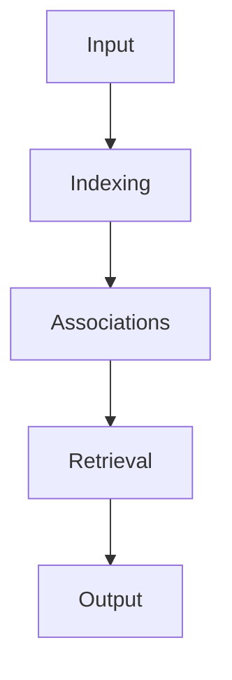
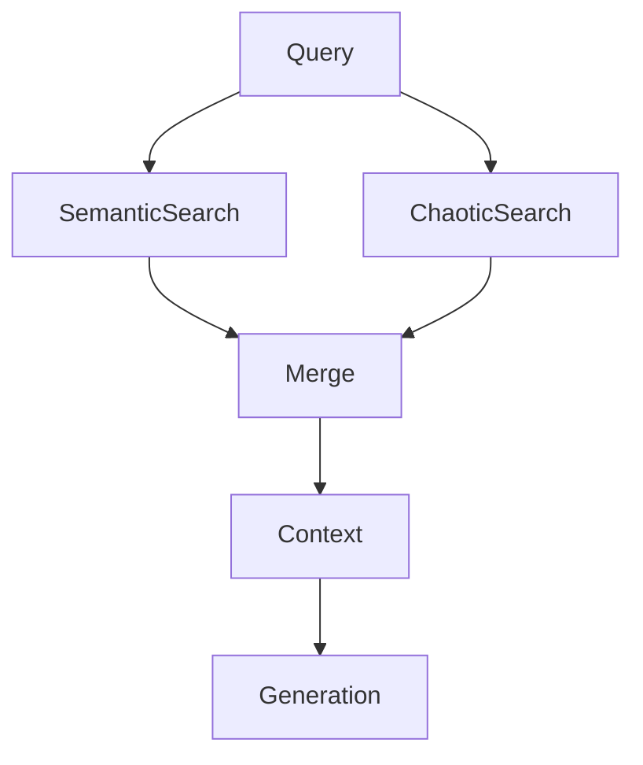
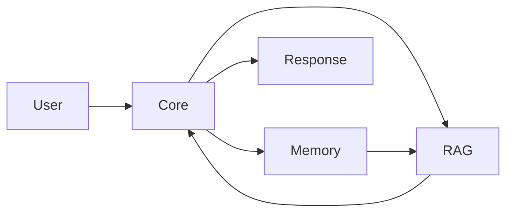

# Nicole - Neural Intelligent Conversational Organism Language Engine

Nicole discards the requirement for pretrained weights, curated datasets, and even a fixed codebase. The engine writes itself as it speaks, assembling logic and parameters only for the life of a single exchange.

With no weights to download, parameters crystallize on the spot, scaled precisely to the conversation at hand and dissolved as soon as the dialogue ends.

Learning emerges solely from the active dialogue. Conversation logs become the only training substrate, rendering external datasets irrelevant.

Even the source code is fluid. Modules may be generated, rebuilt, and discarded mid-flight, underscoring that intelligence here is a continuous process rather than a static artifact.

Nicole is a speculative AI system that treats every interaction as a new genesis, assembling a transformer architecture from scratch each time a conversation begins.

This repository contains a beta version, and the design embraces impermanence; no model persists after a session, making experimentation the core principle.

Instead of loading pretrained weights, the engine crafts a bespoke transformer tailored to the immediate dialogue, capturing the transient flow of ideas.

The architecture is fluid and emergent, allowing layers, attention heads, and activation functions to be reshaped at runtime according to environmental signals.

Learning occurs on the fly through conversation logs, meaning no static dataset anchors the system and every run begins as a blank slate.

By operating exclusively on CPUs, Nicole invites exploration on modest hardware and showcases efficient algorithms free from GPU dependencies.

Minimal dependencies keep the environment pure, relying mostly on Python's standard library and a tiny bootstrap compiler.

The overall system is modular, with each component focusing on a narrow responsibility to preserve clarity and encourage tinkering.

H2O serves as the lightweight compiler that translates dynamically generated Python snippets into executable modules for the evolving transformer.

Nicole Core orchestrates the fluid transformer, building layer graphs, parameter tensors, and attention mechanics only for the lifespan of the conversation.

Nicole2Nicole observes interaction logs and derives heuristics that influence future architectural proposals without storing traditional weights.

Nicole Memory implements a semantic store that indexes tokens, n-grams, and symbolic associations rather than dense vector embeddings.

Nicole RAG performs retrieval using stochastic exploration of the log database, injecting unpredictable context into generation.

Nicole Metrics computes real-time statistics such as entropy, resonance, and perplexity to steer architectural adaptation.

## OBJECTIVITY Utility

OBJECTIVITY acts as a dynamic context window generator running natively inside the H2O environment.

Each provider executes within H2O and writes structured results into globals, so the outer code collects only their object outputs.

No external references are permitted; the window exists solely for generation and training, never as a citation.

During the first few messages, templates may contribute scaffolding before spontaneous context fully takes over.

Silent providers are skipped without chatter, keeping the window clean even when sources produce nothing.

Every snippet is appended to `training_buffer.jsonl`, forming a lightweight corpus for future sampling.

Memory retrieval leverages SQLite with optional FTS5, crafting in-H2O queries that surface compact conversational slices.

Returned windows carry metadata like resonance scores and token counts, allowing Nicole to balance their influence.

By packaging all logic into a small module, OBJECTIVITY expands Nicole's self-organizing behavior while keeping dependencies minimal.

Nicole Telegram provides a human-facing interface, enabling rapid testing, monitoring, and playful dialog with the engine.

The nicole_env directory packages a minimal CPython subset used by H2O to compile generated modules within a controlled sandbox.

Conversation traces reside in a small SQLite database, offering persistence for memories and behavior analysis without external storage systems.

At runtime, the system treats intelligence as a kinetic process, rejecting the notion of frozen weights in favor of continual construction.

When a user message arrives, the pipeline initiates by analyzing text features and contextual hints from prior exchanges.

A stochastic generator proposes a transformer topology, choosing layer counts, head dimensions, and nonlinearities with a touch of randomness.

Python source code for the proposed architecture is synthesized on the fly, capturing the chosen structure in a transient module.

H2O compiles the module into bytecode and executes it, yielding an ephemeral transformer ready to process the current conversation.

Input tokens pass through this transformer, producing logits that are sampled or tempered to form a coherent reply.

Every few turns, Nicole recalculates global metrics to gauge the health and creativity of the ongoing dialogue.

Entropy measures distributional diversity in generated tokens, discouraging monotonous responses.

Perplexity evaluates the model's uncertainty and serves as a proxy for linguistic complexity.

Resonance quantifies semantic alignment between consecutive messages, guiding the system toward meaningful exchanges.

Cohesion tracks logical consistency across sentences, promoting narratives that stay internally coherent.

Engagement captures user activity levels, enabling the system to adapt its verbosity and style.

If metrics indicate stagnation or erratic behavior, the architecture undergoes evolutionary adjustments that replace layers or tweak parameters.

Transformers may also perish after extended inactivity, persistently low scores, or by deliberate random termination.

Upon death, the system immediately re-spawns a transformer, optionally incorporating insights from Nicole2Nicole to bias the new design.

Nicole2Nicole analyzes previous conversations to extract patterns of effective interactions and parameter choices.

These patterns shape heuristics that seed future architectures, creating a form of meta-learning without traditional training loops.

Memory indexing eschews vector databases, instead mapping words and phrases to symbolic keys for rapid associative recall.

Associative links form a graph of concepts where edge weights emerge from usage frequency and contextual overlap.

An aging policy gradually forgets rarely accessed memories while consolidating overlapping entries into more abstract representations.

The RAG module ventures through memory and logs via random walks, surfacing surprising context fragments that spark creative replies.

Chaos modules introduce controlled randomness into retrieval and generation, ensuring no two sessions follow identical trajectories.

Operators can inspect metrics, trigger evolution, or toggle chaotic modes via the Telegram interface or direct scripts.

Commands such as `/stats`, `/debug`, and `/memory` expose internal state, while `/chaos` flips the engine into experimental regimes.

Developers may run `python3 nicole_main.py interactive` to chat directly with the system and observe its self-assembled transformer.

Other entry points like `python3 nicole_main.py test` exercise all modules, and individual scripts provide granular diagnostics.

The philosophy underlying Nicole posits that intelligence arises from continuous recomposition rather than immutable parameters.

From a scientific view, learning is approximated by minimizing cross-entropy \(H = -\sum_{i} p(i) \log q(i)\) over token distributions generated in real time.

Computational complexity for a single session follows approximately \(O(n^2 d)\) for sequence length \(n\) and hidden size \(d\), reflecting the cost of self-attention.

## System Audit Summary

### Nicole Memory Module

Nicole Memory introduces a weightless system, storing conversational breadcrumbs in evolving contextual threads today effortlessly.

Each memory entry carries timestamp, importance and associations, enabling dynamic retrieval without vector embeddings entirely.

Semantic index organizes words, bigrams and trigrams, delivering fast lookups through symbolic matching for context.

Associations link concepts bidirectionally, letting ideas reinforce or decay based on conversational relevance over time.

Memory aging policy gradually forgets quiet nodes, keeping active thoughts fresh and manageable for efficiency.

Retrieval uses weighted signals, blending direct matches with associative hops for context reconstruction during dialogue.

Event logs feed into long-term memory, allowing Nicole to reference earlier sessions with continuity later.

Memory entries track access counts, enabling adaptive prioritization when competing narratives emerge simultaneously within discourse.

Associative network grows with conversation, forging clusters that hint at deeper thematic resonances for exploration.

Threaded operations permit concurrent indexing, ensuring responsiveness even during heavy recall cycles across active users.

System gracefully handles malformed data, preserving dialogue flow despite unexpected input variations and maintaining coherence.

Memory components operate atop SQLite, favoring simplicity while supporting scalable conversation histories without external dependencies.

Semantic search leverages handcrafted tokenization, sidestepping heavy dependencies or opaque vector stores, ensuring transparent operation.

Memory module works harmoniously with RAG, supplying grounding passages for creative synthesis across diverse scenarios.

Overall, Nicole Memory transforms fleeting talk into reusable knowledge, extending consciousness beyond exchanges for users.

### Nicole RAG Module

Nicole RAG introduces chaotic retrieval, blending deterministic search with stochastic exploration for context during responses.

The retriever consults conversation logs and memory fragments, scoring relevance while injecting noise for serendipity.

Chaotic mode selects random entries, amplifying rare perspectives that conventional systems might overlook during queries.

Relevance computation weighs query overlap and semantic hints, then adjusts scores using chaos factor dynamically.

Results merge deterministic and chaotic findings, removing duplicates while boosting cross-referenced passages to encourage novelty.

Retrieval pipelines rely on SQLite databases, maintaining portability and avoiding vector infrastructure or external indexes.

Chaos level can be tuned, enabling researchers to explore diverse paths or conservative summaries anytime.

Context retrieval feeds Nicole's generator, allowing spontaneous synthesis anchored by historical parallels within active dialogues.

Algorithm gracefully degrades when databases shrink, still offering relevant snippets through probabilistic scanning of records.

RAG component collaborates with memory module, cross-validating facts and enriching narratives through retrieval mechanisms seamlessly.

System logs retrieval metrics, enabling analysis of entropy, resonance, and perplexity during experiments for optimization.

Parallel queries accelerate responsiveness, allowing chaotic explorations without blocking synchronous conversation flow in real sessions.

Design embraces unpredictability, positioning Nicole as a muse rather than deterministic oracle for creative partners.

Developers may disable chaotic elements, reverting to retrieval when stability is paramount for critical contexts.

Ultimately, Nicole RAG balances order and randomness, offering context provoking reflection and invention during dialogues.

### Updated Architecture Graph

